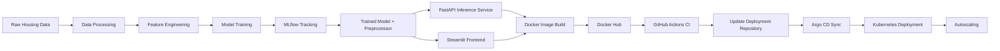
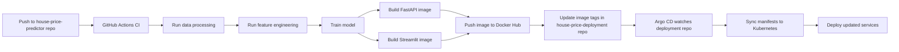
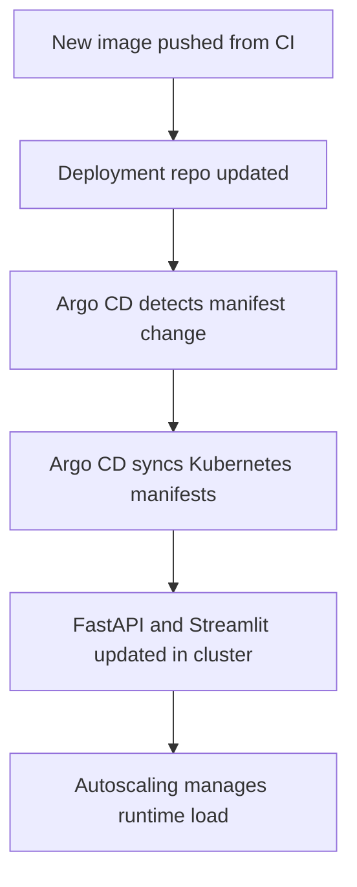

# 🏠 House Price Predictor

An end-to-end **MLOps project** for predicting house prices, covering the complete workflow from **data preprocessing and model training** to **containerization, CI/CD automation, GitOps-based Kubernetes deployment, and autoscaling**.

---

## ✨ Highlights

* Data preprocessing and feature engineering pipeline
* Model training with experiment tracking using MLflow
* FastAPI backend for inference
* Streamlit frontend for interactive predictions
* Dockerized FastAPI and Streamlit services
* GitHub Actions CI pipeline for build, test, and image publishing
* Separate deployment repository for Kubernetes manifests
* GitOps-based CD using Argo CD
* Kubernetes deployment with autoscaling support

---

## 📂 Repository Structure

```text
house-price-predictor/
├── configs/                  # Model configuration
├── data/                     # Raw and processed datasets
├── deployment/
│   ├── mlflow/               # MLflow setup
│   └── monitoring/           # Monitoring and autoscaling related configs
├── kind/                     # Local Kubernetes cluster config
├── models/                   # Trained model and preprocessor artifacts
├── notebooks/                # EDA, experimentation, feature engineering notebooks
├── src/
│   ├── api/                  # FastAPI inference service
│   ├── data/                 # Data preprocessing pipeline
│   ├── features/             # Feature engineering pipeline
│   └── models/               # Model training pipeline
├── streamlit_app/            # Streamlit frontend
├── Dockerfile                # FastAPI image build
├── docker-compose.yaml       # Local multi-service run
└── requirements.txt
```

---

## 🔄 End-to-End Workflow



---

## 🧠 Project Workflow

The project is implemented in the following stages:

1. **Data Processing**
   Clean and prepare the raw housing dataset.

2. **Feature Engineering**
   Transform the cleaned data and create the preprocessing artifact.

3. **Model Training**
   Train the house price prediction model and store trained artifacts.

4. **Experiment Tracking**
   Log training runs, parameters, and metrics using MLflow.

5. **Inference Layer**
   Serve the trained model through a FastAPI backend.

6. **Frontend Layer**
   Build a Streamlit interface for interactive predictions.

7. **Containerization**
   Package both FastAPI and Streamlit applications as Docker images.

8. **CI Pipeline**
   Build, test, and publish Docker images through GitHub Actions.

9. **GitOps Deployment**
   Update image tags in a separate deployment repository and let Argo CD sync them to Kubernetes.

10. **Autoscaling**
    Scale the deployed application in Kubernetes based on runtime traffic and metrics.

---

## 🚀 Running the Project Locally

### 1) Clone the repository

```bash
git clone https://github.com/<your-username>/house-price-predictor.git
cd house-price-predictor
```

### 2) Create and activate a virtual environment

```bash
python -m venv .venv
source .venv/bin/activate
```

### 3) Install dependencies

```bash
pip install -r requirements.txt
```

### 4) Start MLflow

```bash
cd deployment/mlflow
docker compose -f mlflow-docker-compose.yml up -d
cd ../..
```

### 5) Run the ML pipeline

Run the pipeline in the following order:

* **Data processing**
* **Feature engineering**
* **Model training**

This generates:

* processed datasets
* preprocessor artifact
* trained model artifact

### 6) Run FastAPI and Streamlit locally

```bash
docker compose up --build
```

After startup:

* **FastAPI** → `http://localhost:8000`
* **FastAPI Docs** → `http://localhost:8000/docs`
* **Streamlit** → `http://localhost:8501`

---

## 📦 Model Artifacts

The training pipeline generates the following artifacts inside the project:

* **Processed datasets** under `data/processed/`
* **Preprocessor artifact** under `models/trained/`
* **Trained model artifact** under `models/trained/`

---

## 🐳 Containerized Services

The project contains two application services:

* **FastAPI service** for model inference
* **Streamlit service** for frontend predictions

Both services are built as Docker images and used for local execution as well as Kubernetes deployment.

---

## ⚙️ CI/CD Workflow

This project follows a **two-repository GitOps workflow**:

### Application Repository

Contains:

* ML pipeline code
* FastAPI service
* Streamlit app
* Docker configuration
* GitHub Actions workflow

### Deployment Repository

Contains:

* Kubernetes manifests for FastAPI and Streamlit
* service definitions
* autoscaling manifests
* deployment configuration consumed by Argo CD

---

## 🔁 CI/CD Flow



---

## ☸️ Kubernetes Deployment

The application is deployed through a separate repository containing Kubernetes manifests for:

* FastAPI deployment and service
* Streamlit deployment and service
* autoscaling configuration
* kustomization files for deployment management

Argo CD watches this deployment repository and automatically syncs any manifest updates to the Kubernetes cluster.

---

## 📈 Autoscaling

Autoscaling is configured for the deployed FastAPI service in Kubernetes so the application can adapt to runtime load and traffic conditions after deployment.

---

## 📊 Deployment Flow



---

## 🙌 Summary

This project demonstrates a complete **MLOps workflow** for a house price prediction system, including:

* training pipeline
* experiment tracking
* model serving
* frontend integration
* Docker packaging
* CI automation
* GitOps deployment
* Kubernetes rollout
* autoscaling in production-style deployment

---
